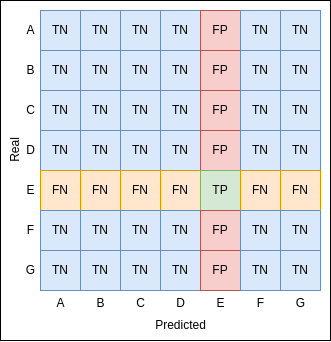

# Analysis

Notebooks to extract metrics and images from CNN models trainings:
* [Database](database.ipynb)

Notebook to create and fill the `database.db` file:

___
* [investigationTopics](investigationTopics.ipynb)

Notebook to compare techniques and metric values.
___
* [statistics](statistics.ipynb)

Notebook to show metrics and images from the SQLite database.
___
* [statisticsGANs](statisticsGANs.ipynb)

Notebook to show metrics and images from the SQLite database where the GANs configuration have been set as data augmentation.
___
**Note**: ViT information was not contemplated in previous notebooks.

## Environment Statistics
RAM (GB) | Hardware | Number of tranings performed
:---: | :---: | :---:
25.5 | T4 GPU | 14
83.5 | A100 GPU | 51
12.7 | TPU | 3

## Metrics Overview

Label | Description
:---: | :---:
FN | False Negative
FP | False Positive
TN | True Negative
TP | True Positive

### Confusion Matrices

### Metric Formulas

